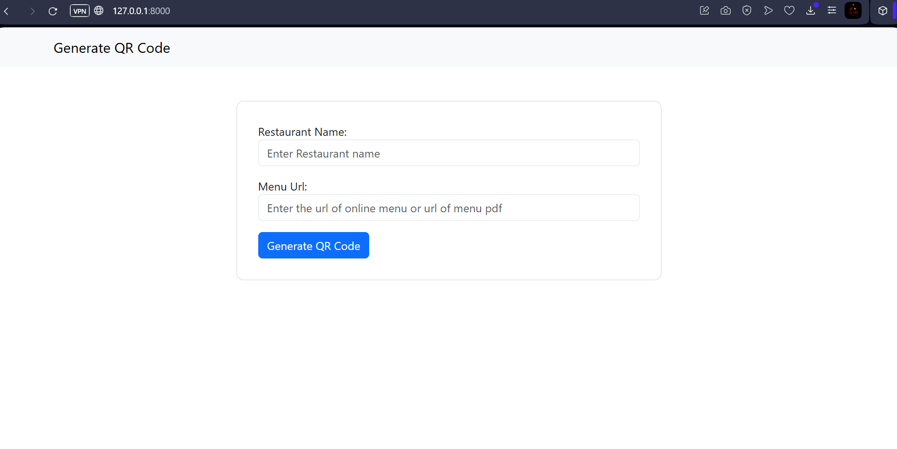
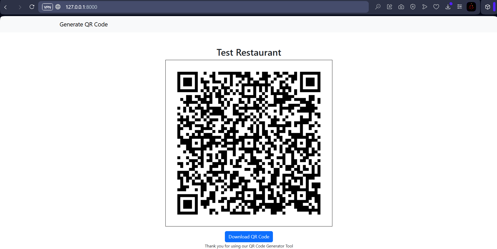

# 🍽️ QR Code Generator for Restaurant Menus

A simple **Django web app** that generates **QR codes** for restaurants, linking directly to their **menu PDFs or webpage URLs**.  
The project uses **Python’s `qrcode`** and **`Pillow`** libraries to dynamically generate and display QR codes in the browser.

---

## 🚀 Features
- 🏷️ Input your **restaurant name**
- 📄 Add url of a **menu PDF**, **Google Drive link**, or **website link**
- ⚡ Instantly generate a **QR code** that redirects customers to the menu
- 🖼️ View the generated QR code directly on the web page
- 💾 Download the QR image

---

## 🛠️ Tech Stack
- **Backend:** Django (Python)
- **Libraries:** `qrcode`, `Pillow`
- **Frontend:** HTML + Bootstrap (simple two-page UI)
- **Database:** SQLite (default Django DB)

---

## 📁 Project Structure
```bash
qr-code-django/
├── media/                  # for storing media files (locally or for developement purpose)
├── qr_code/                # Main Django app
│   ├── asgi.py
│   ├── forms.py
│   ├── settings.py
│   ├── urls.py
│   ├── views.py                     
│   └── wsgi.py
├── templates/          # HTML pages (form + result)
├── manage.py
├── README.md
└── requirements.txt

```

---

## ⚙️ Installation & Setup

### 1️⃣ Clone the repository
```bash
git clone https://github.com/vedp18/qr-code-django.git
cd qr-code-django
```

### 2️⃣ Create and activate a virtual environment

```bash
python -m venv .venv
# On Windows:
.venv\Scripts\activate
# On macOS/Linux:
source .venv/bin/activate
```

### 3️⃣ Install dependencies

```bash
pip install -r requirements.txt
```

### 4️⃣ Run database migrations

```bash
python manage.py migrate
```

### 5️⃣ Start the development server

```bash
python manage.py runserver
```

Visit [http://127.0.0.1:8000](http://127.0.0.1:8000) to open the app.

---

## 🧠 How It Works

1. User opens the web form (home page).
2. Enters restaurant name + provides menu PDF link or web page url.
3. Django backend processes input and encodes the link/data into a QR code using:

   ```python
   import qrcode
   from PIL import Image
   ```
4. The generated QR code is rendered on the result page using Pillow.

---

## 📸 Screenshots

| Home Page                        | QR Code Result                       |
| -------------------------------- | ------------------------------------ |
|  |  |

---

## 🧾 Example Menu URL QR

```text
[https://drive.google.com/file/d/your-menu-id/view](https://drive.google.com/file/d/1i63ZJi5LKJSWP6zniCnkbstCNId8x_d_/view)
```

Generated QR Code → Scan → Opens Menu in Browser.

---


## 🧑‍💻 Author

**Ved Patel**
🔗 [LinkedIn](https://linkedin.com/in/ved--patel)

---